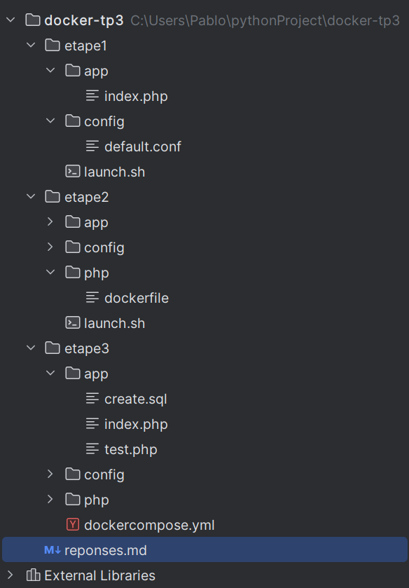

Arborescence : 

Étape 1 — Nginx + PHP-FPM (sans Compose)

Objectif :

Mettre en place deux containers qui communiquent entre eux :

HTTP → Nginx, accessible sur le port 8080.

SCRIPT → PHP-FPM, chargé d’exécuter le code PHP.

Les deux containers partagent un même réseau Docker (tp3-net), et le code (ici un index.php avec un simple phpinfo()) est monté via un bind mount dans /app.

Ce que j’ai compris :

Nginx ne traite pas le PHP lui-même : il redirige les requêtes vers PHP-FPM à l’aide de fastcgi_pass.

Sur le réseau Docker, les containers peuvent se joindre par leur nom (ex : script:9000).

Étape 2 — Ajout de MariaDB et mysqli
Objectif :

Introduire un troisième container DATA (MariaDB) et faire un petit test de connexion depuis un script PHP (test.php) avec un CRUD minimal.

J’ai créé une image PHP personnalisée pour y inclure l’extension mysqli, nécessaire pour communiquer avec MariaDB.

test.php fait un INSERT suivi d’un SELECT, et affiche un compteur qui s’incrémente à chaque rafraîchissement.

Ce que j’ai compris :

L’extension mysqli n’est pas toujours intégrée de base : il faut l’ajouter avec docker-php-ext-install mysqli.

Au démarrage, la base peut mettre quelques secondes à être opérationnelle. Si on recharge trop vite la page, une erreur peut apparaître — il suffit d’attendre un peu et de réessayer.

Étape 3 — Passage à Docker Compose
Objectif :

Regrouper les trois services (HTTP, SCRIPT, DATA) dans un seul fichier docker-compose.yml.

Les services :

data : MariaDB

script : PHP-FPM avec l’extension mysqli

http : Nginx

Même logique que précédemment : même réseau, mêmes volumes, même conf.
J’ai simplement ajouté un petit sleep côté PHP pour laisser le temps à MariaDB de démarrer avant de se connecter (utile sans healthcheck).

Ce que j’ai compris :

Docker Compose permet de décrire l’ensemble de la stack dans un fichier unique, sans avoir à lancer plusieurs docker run.

Outils utilisés

-Docker Desktop, Docker CLI, Docker Compose

-Nginx, PHP-FPM, MariaDB

-Bind mounts, réseaux Docker

-Git / GitHub

Conclusion : 

Ce TP m’a vraiment permis de comprendre comment isoler chaque rôle dans une architecture multi-container et de voir concrètement comment ils interagissent entre eux.
J’ai aussi mieux saisi la logique de Docker Compose, qui simplifie la gestion de plusieurs services en rendant la configuration claire, réutilisable et portable.
En somme, cette approche en trois étapes m’a permis de passer d’une simple exécution manuelle à une stack complète, cohérente et automatisée.

